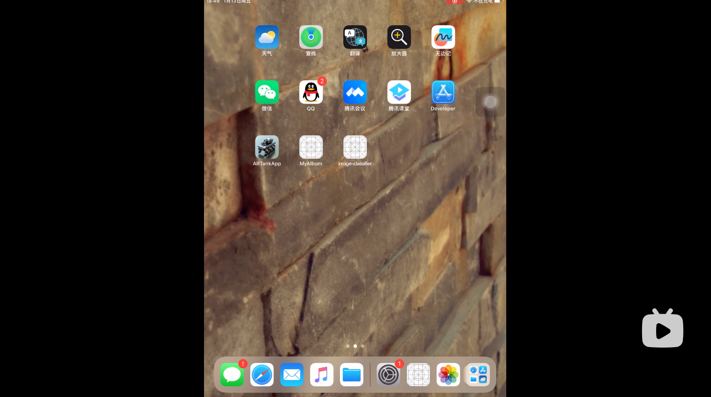
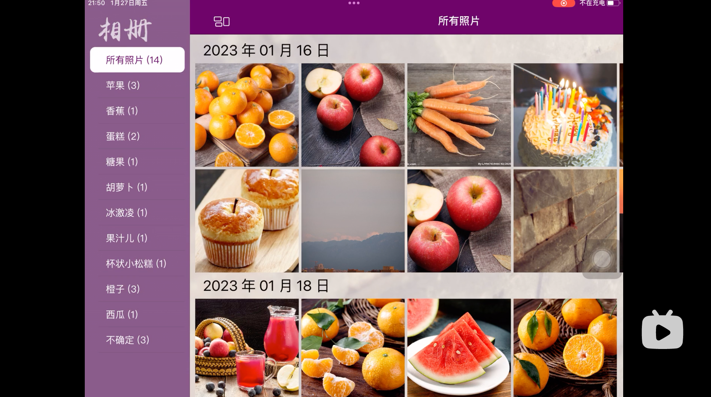
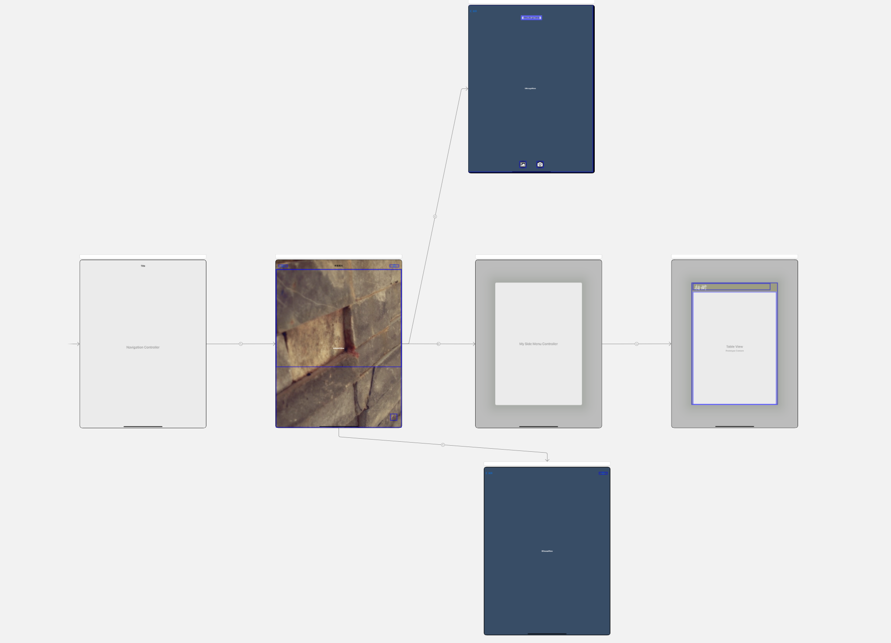
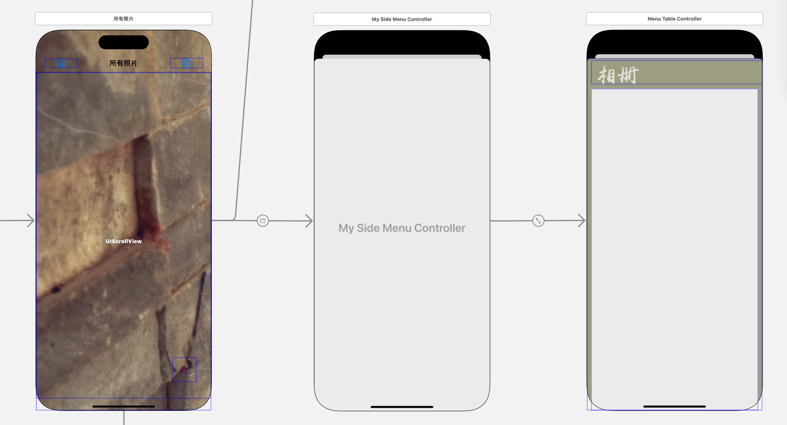

# IW FINAL 自制相册

> 本人本科期间的课程作业，有许多不够好以及有问题的地方，欢迎批评与交流。 :tada:

* **[简介](#简介)**
  * [功能介绍](#功能介绍)
  * [展示视频](#展示视频)
* **[技术实现](#技术实现)**
  * [视图结构](#视图结构)
  * [侧边栏](#侧边栏)
  * [主视图](#主视图)
  * [加入视图](#加入视图)
  * [照片详情页](#照片详情页)
  * [数据持久化](#数据持久化)
* **[感谢评阅](#aaa)**

## 简介

### 功能介绍

该 APP 是一个智能相册，用户可以从系统相册选择或直接拍摄一张照片，该 APP 会根据此照片内容对照片进行目标检测，并自动加入对应的分类中。每个分类的图像按加入时间排序，加入时间相同的照片为一组。用户可以在侧边栏中选择查看所有照片或某一个不为空的分类。

点击某一张图片跳转进入该图片的详情页，用户可以选择显示/隐藏该图片的 bounding box，查看详细信息或从智能相册中删除此图片。

支持数据持久化。

### 展示视频

OneMonth：

[](https://www.bilibili.com/video/BV1CG4y1S7Dy/)

Final：

[](https://www.bilibili.com/video/BV1ZY4y1R7pn/)

## 技术实现

### 视图结构



### 侧边栏

> 使用了 Github 上开源的包：[SideMenu](https://github.com/jonkykong/SideMenu)

#### 界面布局



使用 SideMenuNavigationController 管理一个子视图，子视图上进行侧边栏的界面布局。在相册的主视图通过 Present Modally segue 与 SideMenuNavigationController 建立跳转关系，实现侧边栏的显示与隐藏。

#### 侧边栏内容

> MenuTableController.swift

侧边栏主要由一个 UIImageView 和 一个 UITableView 组成，前者用于展示相册 logo 如上图所示，后者用于展示已加入图片的分类，点击对应的 cell 更新相册的主视图。

侧边栏显示的第一个分类为“所有照片”，除此之外的其他分类只有当对应分类不为空时才在侧边栏显示：

```swift
// 遍历其他分类，将非空分类的下标加入显示列表
indexOfTileToShow.append(0)
for i in 1 ..< MyAlbumData.categoryNumber {
   if !(MyAlbumData.getImageSet(index: i).isEmpty) {
      indexOfTileToShow.append(i)
   }
}
```

根据当前相册主视图导航栏的标题设置默认选中的 cell：

```swift
for i in 0 ..< indexOfTileToShow.count {
   let index = indexOfTileToShow[i]
   // 找到待显示的分类中名称与主视图标题相同的分类
   if album!.navigationItem.title == MyAlbumData.getCategoryTitle(index: index) {
      let selectedIndex = IndexPath(row: i, section: 0)
      // 将对应的 cell 设置为选中状态
      self.tableView.selectRow(at: selectedIndex, animated: true, scrollPosition: .none)
      break
   }
}
```

点击对应的 cell 更新自身样式与主视图内容：

```swift
class MenuTableCell: UITableViewCell {
   ...
   // 被点击时根据选中状态改变 cell 样式
   override func setSelected(_ selected: Bool, animated: Bool) {
      if selected {
         self.backgroundColor = .white
         self.titleLabel.textColor = MyAlbumData.currentTheme.themeColor
      } else {
         self.backgroundColor = .clear
         self.titleLabel.textColor = MyAlbumData.currentTheme.lightTextColor
      }
   }
   // 不显示 cell 高亮状态
   override func setHighlighted(_ highlighted: Bool, animated: Bool) {
   }
}
```

根据选中 cell 对应的标题设置主界面的标题，并调用刷新主界面内容的方法。

```swift
func tableView(_ tableView: UITableView, didSelectRowAt indexPath: IndexPath) {
   let index = indexOfTileToShow[indexPath.row]
   let title = MyAlbumData.getCategoryTitle(index: index)
   album?.provideViewData(title: title, rowNum: index)
}
```

### 主视图

> AlbumViewController.swift

与 IW2 中使用的方法相同，使用 UIScrollView 管理内容，并实现动态更新。详见 IW2 的 README。

主视图的内容组织方式，加入日期相同的照片为一组：

- 一个 UILabel 显示该组照片的加入时间；
- 一个纵向的 UIStackView，其中根据照片数量，包含若干行横向的 UIStackView，每个横向的 StackView 中包含 5 个相同大小的方形 UIImageView。
- 控件数量和 UIImageView 的内容在主视图内容刷新时动态确定。

**主视图内容刷新机制：**

```swift
func reloadView() {
   // 重置高度约束
   ...
   // 删除所有子控件
   ...
   // 根据当前标题获取对应分类的图集
   let imageSet = MyAlbumData.getImageSet(title: self.navigationItem.title!)
   // 获取该图集中所包含的所有日期
   let dates = imageSet.imageDates
   for date in dates {
      // 生成一个用于展示日期的 label
      let dateLabel = UILabel()
      // 设置 label 字号
      ...
      // 加入视图并设置约束
      ...
      // 取出当前日期对应的图集
      let subImageSet = imageSet.imageSet[date]!
      var i = 0
      while i < subImageSet.count {
         // 生成一个 stackView 用于展示一行（5张）图片
         let stackView = AlbumStackView()
         ...
         // 自定义约束
         ...
         for j in 0 ..< 5 {
            if i >= subImageSet.count {
               break
            }
            stackView.imageViews[j].setImage(subImageSet[i])
            // 添加手势，点击图片后跳转至详情页
            let guesture = UITapGestureRecognizer(target:self,action:#selector(imageSingleTap(_:)))
            stackView.imageViews[j].addGestureRecognizer(guesture)
            i += 1
      }

   }
   // 更新高度约束
   ...
}
```

### 加入视图

> AddViewController.swift

界面布局复用了 IW3 中的框架，将调用的模型更换为了 IW4 中使用的目标检测模型。

**一点细节：**

在屏幕旋转时，由于图像位置发生变化，需要重新将 bounding box 绘制到正确的位置：

```swift
// 横屏时重新绘制 boundingBox
override func didRotate(from fromInterfaceOrientation: UIInterfaceOrientation) {
   // bugfix - 1.16: 没有选择照片时，横屏不做操作
   // 否则由于 imageView.image 为 nil，导致 APP crash
   if self.imageView.image == nil {
      return
   }
   BoundingBoxView.show(predictions: preResults, imageView: self.imageView, boundingBoxViews: self.boundingBoxViews)
}
```

**人工确认分类：**

当目标检测完成时，根据识别的目标种类生成弹窗，用户可以选择要加入的分类。


这里用到了自定义的弹窗类 `SelectAlertController`，该弹窗中包含一个 UITableView，每一个 cell 对应一个选项。其中“不确定”项与其他选项冲突，当“不确定”项勾选时，自动取消选择其他选项，当其他选项勾选时，自动取消选择“不确定”项。

用户选择完成后，点击保存，则会根据用户的选择结果将其加入对应的分类中：

```swift
func saveImage(_: UIAlertAction) {
   MyAlbumData.getImageSet(title: "所有照片").addImage(self.image)
   // 设置图片的“所在分类”属性
   for i in 0 ..< self.isSelected.count {
      if isSelected[i] {
         let str = self.results[i]
         self.image.categories.append(str)
      }
   }
   // 根据图片“所在分类”属性加入对应的分类数组
   for str in self.image.categories {
      MyAlbumData.getImageSet(title: str).addImage(self.image)
   }
   MyAlbumData.saveData()
}
```

### 照片详情页

> DetailViewController.swift

点击右上角的 button，生成弹窗，包含三个选项：“查看详情”、“显示/隐藏边框”、“删除照片”。

定义弹窗：

```swift
lazy var alertController: UIAlertController = {
   let alertController = UIAlertController(title: nil, message: "查看图片信息，\n显示 boundingBox，或删除图片", preferredStyle: .actionSheet)
        
   alertController.view.tintColor = MyAlbumData.currentTheme.themeColor
        
   let cancelAction = UIAlertAction(title: "取消", style: .cancel, handler: nil)
   let deleteAction = UIAlertAction(title: "删除", style: .destructive, handler: deleteActionHandle)
   let infoAction = UIAlertAction(title: "详情", style: .default, handler: infoActionHandle)
   let showAction = UIAlertAction(title: "边框", style: .default, handler: showActionHandle)
        
   alertController.addAction(cancelAction)
   alertController.addAction(infoAction)
   alertController.addAction(showAction)
   alertController.addAction(deleteAction)
        
   return alertController
}()
```

在 iPad 中显示 actionSheet 风格的弹窗：

```swift
@IBAction func showOptions(_ sender: Any) {
   let sendView = sender as! UIView
   alertController.popoverPresentationController!.sourceView = sendView
   alertController.popoverPresentationController!.sourceRect = sendView.bounds
   alertController.popoverPresentationController!.permittedArrowDirections = UIPopoverArrowDirection.any
   self.present(alertController, animated: true, completion: nil)
}
```

- 查看详情：

  ```swift
  func infoActionHandle(_ : UIAlertAction) {
     let message = "加入时间：\(myAlbumImage.date)\n所在分类：\(myAlbumImage.categories)"
     let alert = UIAlertController(title: "图片详情", message: message,preferredStyle: .alert)
     alert.view.tintColor = UIColor(red: 121.0 / 255.0, green: 131.0 / 255.0, blue: 108.0 / 255.0, alpha: 1.0)
     let action = UIAlertAction(title: "确定", style: .default, handler: nil)
     alert.addAction(action)
     self.present(alert, animated: true, completion: nil)
  }
  ```

- 删除照片：

  ```swift
  // 将照片从整个相册中删除
  func deleteActionHandle(_ : UIAlertAction) {
     // 从所有照片中删除
     let imageSet = MyAlbumData.imageSets!["所有照片"] as! MyAlbumImageSet
     imageSet.removeImage(self.myAlbumImage)
     for str in self.myAlbumImage.categories {
     let imageSet = MyAlbumData.imageSets![str] as! MyAlbumImageSet
        imageSet.removeImage(self.myAlbumImage)
     }
     MyAlbumData.saveData()
     // 代码实现 navigation 返回上一层视图
     self.navigationController?.popViewController(animated: true)
  }
  ```

- 显示/隐藏边框：

  ```swift
  var isShow = false
  
  func showActionHandle(_ : UIAlertAction) {
     if !isShow {
        BoundingBoxView.show(predictions: myAlbumImage.detegateResults!, imageView: self.imageView, boundingBoxViews: self.boundingBoxViews)
        isShow = true
     } else {
        // 隐藏已绘制的 boundingBoxViews
        for box in boundingBoxViews {
           box.hide()
        }
        isShow = false
     }
  }
  ```

### 数据持久化

> AppData.swift

**自定义图像类：**

```swift
class MyAlbumImage: NSObject, NSSecureCoding {
   ...
   let image: UIImage
   let detegateResults: [VNRecognizedObjectObservation]?
   let date: String
   var categories: [String]
   ...
}
```

- image：照片本身；
- detegateResults：加入照片时目标检测的结果，用于在详情页重新绘制 bounding box；
- date：照片加入时间；
- categories：照片所在分类。

**自定义图集类：**

```swift
class MyAlbumImageSet: NSObject, NSSecureCoding {
   ...
   var imageDates = [String]()
   var imageSet = [String : [MyAlbumImage]]()
    
   var count: Int {
      get {
         var num = 0
         for str in imageDates {
            num += imageSet[str]!.count
         }
         return num
      }
   }
    
   var isEmpty: Bool {
      get {
         for i in imageSet {
         if i.value.count > 0 {
            return false
         }
      }
         return true
      }
   }
   ...
}
```

- imageDates：当前分类中包含图片的加入日期；
- imageSet：建立日期与图片数组的映射。

**向磁盘读写数据：**

> 需要序列化的对象均须继承 NSObject 与 NSSecureCoding，并实现 encode 与 decode 两个方法。

相册数据初始化：

```swift
imageSets = [
   "所有照片":MyAlbumImageSet(),
   "苹果":MyAlbumImageSet(),
   "香蕉":MyAlbumImageSet(),
   "蛋糕":MyAlbumImageSet(),
   "糖果":MyAlbumImageSet(),
   "胡萝卜":MyAlbumImageSet(),
   "曲奇":MyAlbumImageSet(),
   "甜甜圈":MyAlbumImageSet(),
   "葡萄":MyAlbumImageSet(),
   "热狗":MyAlbumImageSet(),
   "冰激凌":MyAlbumImageSet(),
   "果汁儿":MyAlbumImageSet(),
   "杯状小松糕":MyAlbumImageSet(),
   "橙子":MyAlbumImageSet(),
   "菠萝":MyAlbumImageSet(),
   "爆米花儿":MyAlbumImageSet(),
   "双圈饼干":MyAlbumImageSet(),
   "沙拉":MyAlbumImageSet(),
   "草莓":MyAlbumImageSet(),
   "华夫饼":MyAlbumImageSet(),
   "西瓜":MyAlbumImageSet(),
   "不确定":MyAlbumImageSet()
]
```

读取：

```swift
let data = try Data.init(contentsOf: URL(fileURLWithPath: savePath))
// 当用户首次登陆, 直接从沙盒获取数据, 就会为nil  所以这里需要使用as?
imageSets = try NSKeyedUnarchiver.unarchiveTopLevelObjectWithData(data) as? NSDictionary
```

写入：

```swift
let data = try NSKeyedArchiver.archivedData(withRootObject: imageSets!, requiringSecureCoding: true)
_ = try data.write(to: URL(fileURLWithPath: savePath))
```

其中 savePath 为该 App 数据目录下的一个文件路径：

```swift
static let savePath = "\(NSSearchPathForDirectoriesInDomains(.documentDirectory, .userDomainMask, true).first!)/album.data"
```

每次加入图像后在后台线层调用写入方法，即使保存修改的数据并避免主线程卡顿：

```swift
static func saveData() {
   // 异步执行，避免占用主线程导致用户交互卡顿
   writeDiskQueue.async {
      do {
         let data = try NSKeyedArchiver.archivedData(withRootObject: imageSets!, requiringSecureCoding: true)
         do {
            _ = try data.write(to: URL(fileURLWithPath: savePath))
            print("写入成功")
         } catch {
            print("data写入本地失败: \(error)")
         }
      } catch  {
         print("模型转data失败: \(error)")
      }
   }
}
```


<a id="aaa"></a>

【感谢评阅】

